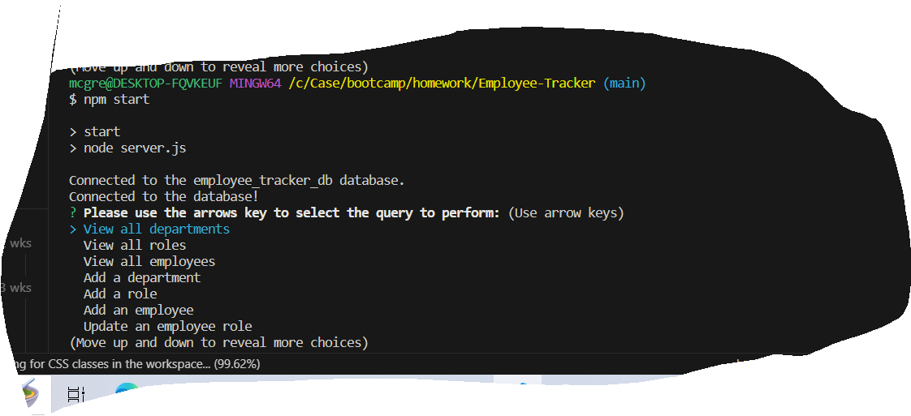
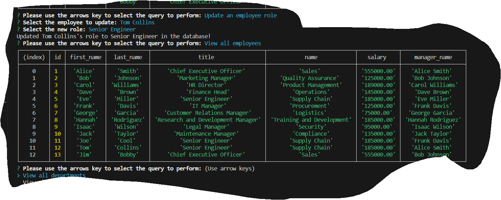

# Employee Tracker

## Description

This project will implement a  **content management systems (CMS)**. Project will build a command-line application from scratch to manage a company's employee database, using Node.js, Inquirer, and MySQL.

## Usage

To view a demo of this application, please view to demo located at https://watch.screencastify.com/v/MR1526fqP708bnHsHX0k

## Source

My repo, is located at <https://github.com/mcgreevyjim66/Employee-Tracker>.
There is source code located in the Employee-Tracker folder.

## Mock-up

## Credits

Author: Jim McGreevy
Date:   9/25/2023

